# Watermarking Digital dengan Metode LSB pada Domain Spasial + Analisis Kompresi JPEG

> Proyek ini mengimplementasikan watermarking digital pakai metode **LSB (Least Significant Bit)** pada gambar grayscale, lalu mengevaluasi ketahanan watermark terhadap kompresi JPEG pada berbagai Quality Factor (QF). Prosesnya mencakup transformasi DCT, kuantisasi, embedding, ekstraksi, dan evaluasi metrik BER, NC, dan PSNR.

---

## 1. Deskripsi Proyek

Watermarking digital adalah teknik menyisipkan informasi tersembunyi ke dalam suatu media seperti gambar, audio, atau video tanpa mengubah kualitas visualnya secara berarti. Tujuan utamanya untuk **perlindungan hak cipta**, **autentikasi**, dan **pelacakan distribusi** konten digital.

Proyek ini pakai pendekatan **LSB (Least Significant Bit)**, yaitu metode paling sederhana dalam watermarking domain spasial, lalu menguji seberapa tahan watermark tersebut setelah gambar dikompres pakai algoritma **JPEG** pada Quality Factor 10 sampai 100.

**Kenapa LSB rentan terhadap JPEG?**
Kompresi JPEG bekerja di domain frekuensi lewat DCT dan kuantisasi. Proses kuantisasi membulatkan koefisien frekuensi tinggi secara agresif, dan ketika dikembalikan ke domain spasial, nilai LSB piksel ikut berubah. Itulah kenapa watermark LSB mudah rusak oleh JPEG.

---

## 2. Cara Kerja Sistem

```
[Gambar Asli]
      |
      v
[1] Load & konversi ke Grayscale (1600x1600)
      |
      v
[2] DCT per blok 8x8 -> analisis koefisien frekuensi
      |
      v
[3] Kuantisasi -> simulasi lossy compression (QF 10/50/100)
      |
      v
[4] Simulasi Kompresi JPEG (PIL) -> lihat degradasi kualitas
      |
      v
[5] Embed Watermark LSB -> ganti bit LSB setiap piksel dengan bit watermark
      |
      v
[6] Kompres gambar ter-watermark -> ekstrak ulang watermark -> hitung BER & NC
      |
      v
[7] Visualisasi grafik BER, NC, PSNR vs Quality Factor
```

---

## 3. Struktur File Output

Setelah menjalankan `watermarking.py`, semua file berikut akan dihasilkan di folder `output/`:

| File Output | Tahap | Deskripsi |
|---|---|---|
| `tahap1_gambar_asli_grayscale.png` | 1 | Gambar asli setelah dikonversi ke grayscale |
| `tahap2a_hasil_dct_gambar.png` | 2 | Visualisasi koefisien DCT seluruh gambar (skala log) |
| `tahap2b_blok_piksel_vs_dct.png` | 2 | Perbandingan nilai piksel vs koefisien DCT blok 8x8 pertama |
| `tahap3_kuantisasi.png` | 3 | Tabel kuantisasi dan hasil kuantisasi blok untuk QF 10, 50, 100 |
| `tahap4_perbandingan_kompresi_qf.png` | 4 | Hasil kompresi gambar pada QF 10, 30, 50, 70, 90, 100 |
| `tahap5_embed_watermark.png` | 5 | Proses embed: watermark, gambar ter-watermark, peta perbedaan |
| `tahap6a_ekstraksi_watermark_semua_qf.png` | 6 | Watermark hasil ekstraksi untuk semua 10 QF |
| `tahap6b_gambar_terkompresi_semua_qf.png` | 6 | Gambar terkompresi untuk semua 10 QF |
| `tahap7a_grafik_ber.png` | 7 | Grafik BER vs Quality Factor |
| `tahap7b_grafik_nc.png` | 7 | Grafik NC vs Quality Factor |
| `tahap7c_grafik_psnr.png` | 7 | Grafik PSNR vs Quality Factor |
| `tahap7d_ringkasan_semua_metrik.png` | 7 | Ringkasan ketiga metrik dalam satu figure |
| `watermarked_original.png` | 5 | File gambar ter-watermark sebelum kompresi |

---

## 4. Tahap 1 - Load & Persiapan Gambar

Gambar input (`foto_kakey.png`) dibuka pakai PIL lalu dikonversi ke mode **grayscale**. Konversi ke grayscale mempermudah pemrosesan karena hanya ada satu kanal intensitas piksel dengan nilai 0-255, tanpa perlu menangani 3 kanal RGB sekaligus.

```python
img = Image.open(NAMA_FOTO).convert("L")
img_array = np.array(img, dtype=np.float64)
```

**Spesifikasi gambar:**

| Parameter | Nilai |
|---|---|
| Nama file | `foto_kakey.png` |
| Ukuran | 1600 x 1600 piksel |
| Mode warna | Grayscale (L) |
| Tipe data array | float64 |
| Total piksel | 2.560.000 |
| Total blok 8x8 | 40.000 blok |

**Output:**

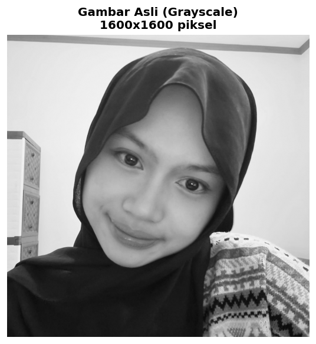

---

## 5. Tahap 2 - DCT (Discrete Cosine Transform)

DCT adalah transformasi matematika yang mengubah sinyal dari **domain spasial** (nilai piksel) ke **domain frekuensi**. JPEG menggunakan DCT pada blok 8x8 piksel.

Ada dua jenis koefisien yang dihasilkan:
- **Koefisien DC**, posisi (0,0), mewakili **nilai rata-rata** seluruh blok. Nilainya besar karena mengandung informasi energi utama.
- **Koefisien AC**, posisi lainnya (63 koefisien), mewakili **variasi frekuensi** dari rendah ke tinggi. Frekuensi tinggi berarti detail halus, frekuensi rendah berarti kontur besar.

**Contoh pada blok 8x8 pertama gambar:**
Blok pertama gambar (pojok kiri atas) nilainya seragam 134 di semua piksel. Hasilnya DCT hanya menghasilkan satu koefisien DC = 1072 dan semua koefisien AC = 0, karena tidak ada variasi frekuensi sama sekali pada area yang seragam.

**Implementasi:**
Proyek ini pakai `scipy.fft.dctn` dengan normalisasi `ortho` untuk efisiensi, menggantikan implementasi manual yang terlalu lambat untuk gambar 1600x1600.

```python
from scipy.fft import dctn, idctn

def dct_2d_fast(block):
    return dctn(block, norm='ortho')

def apply_dct_blocks(image, block_size=8):
    H, W = image.shape
    dct_image = np.zeros_like(image)
    for i in range(0, H - H % block_size, block_size):
        for j in range(0, W - W % block_size, block_size):
            blok = image[i:i+block_size, j:j+block_size]
            dct_image[i:i+block_size, j:j+block_size] = dct_2d_fast(blok)
    return dct_image
```

**Output:**

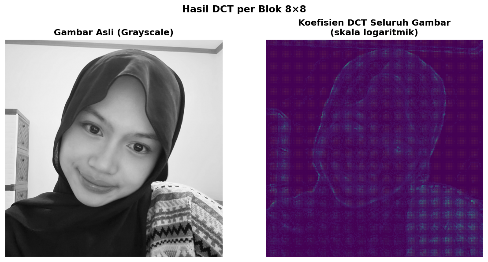

*Pada visualisasi DCT (skala log), area terang di pojok kiri atas menunjukkan energi tinggi pada frekuensi rendah. Ini sesuai dengan sifat alami gambar yang sebagian besar berisi perubahan warna yang gradual, bukan detail tajam.*

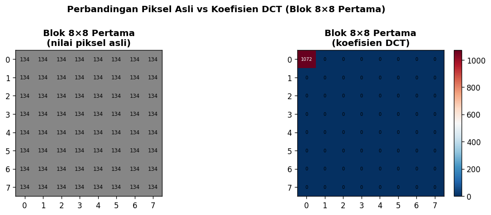

*Kiri: nilai piksel blok 8x8 pertama. Kanan: koefisien DCT dari blok yang sama. Terlihat energi terkonsentrasi di koefisien DC (kiri atas), sedangkan koefisien AC nilainya mendekati nol.*

---

## 6. Tahap 3 - Kuantisasi

Kuantisasi adalah proses **pembulatan** koefisien DCT menggunakan tabel pembagi. Ini adalah inti dari sifat lossy pada JPEG karena koefisien yang kecil setelah dibagi akan dibulatkan ke nol, sehingga banyak detail terutama di frekuensi tinggi yang hilang secara permanen.

Quality Factor (QF) menentukan seberapa agresif kuantisasi dilakukan. Semakin kecil QF, semakin banyak informasi yang hilang.

**Tabel kuantisasi standar JPEG (luminance):**

```
16  11  10  16  24  40  51  61
12  12  14  19  26  58  60  55
14  13  16  24  40  57  69  56
14  17  22  29  51  87  80  62
18  22  37  56  68 109 103  77
24  35  55  64  81 104 113  92
49  64  78  87 103 121 120 101
72  92  95  98 112 100 103  99
```

**Perbandingan koefisien non-zero setelah kuantisasi:**

| QF | Koefisien Non-Zero (dari 64) | Koefisien Hilang | Keterangan |
|---|---|---|---|
| 10 | 1 | 63 (98%) | Hampir semua detail hilang |
| 50 | 1 | 63 (98%) | Blok seragam, hanya DC tersisa |
| 100 | 1 | 63 (98%) | Blok seragam, sama hasilnya |

> **Catatan:** Blok 8x8 pertama pada gambar ini kebetulan seragam (semua piksel bernilai 134), jadi hanya koefisien DC yang bertahan di semua QF. Pada blok dengan variasi piksel, QF yang lebih tinggi akan mempertahankan jauh lebih banyak koefisien.

**Output:**

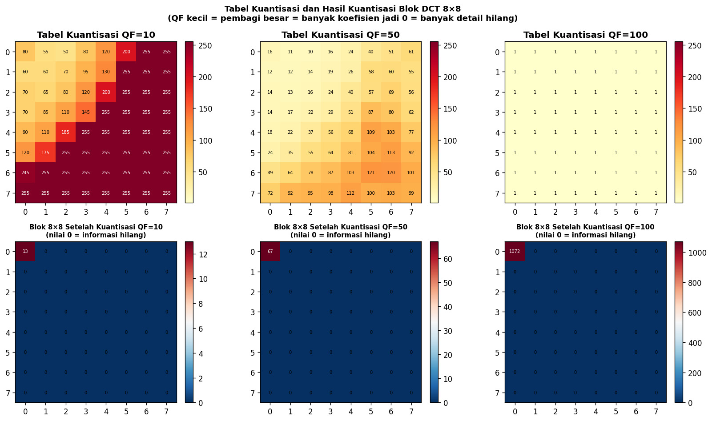

*Baris atas: tabel kuantisasi untuk QF 10, 50, 100, semakin cerah berarti nilai pembagi semakin besar. Baris bawah: blok DCT setelah kuantisasi, QF rendah membuat hampir semua koefisien jadi nol.*

---

## 7. Tahap 4 - Simulasi Kompresi JPEG

Kompresi JPEG secara lengkap melibatkan konversi warna, DCT per blok 8x8, kuantisasi, zigzag scan, run-length encoding, sampai Huffman coding. Di proyek ini seluruh proses tersebut disimulasikan lewat PIL:

```python
def kompresi_jpeg_pil(image_array, qf):
    img_pil = Image.fromarray(image_array.astype(np.uint8), mode="L")
    buffer  = io.BytesIO()
    img_pil.save(buffer, format="JPEG", quality=qf)
    buffer.seek(0)
    return np.array(Image.open(buffer).convert("L"), dtype=np.uint8)
```

**Hasil kompresi gambar asli pada berbagai QF:**

| QF | PSNR (dB) | MSE | Keterangan |
|---|---|---|---|
| 10 | 35.70 | 17.50 | Artefak blok sangat terlihat |
| 30 | 42.53 | 3.63 | Artefak masih terlihat di tepi |
| 50 | 46.23 | 1.55 | Kualitas mulai cukup baik |
| 70 | 50.78 | 0.54 | Kualitas sudah bagus |
| 90 | 58.17 | 0.10 | Hampir tidak ada perbedaan |
| 100 | 64.68 | 0.02 | Sangat mendekati lossless |

**Output:**

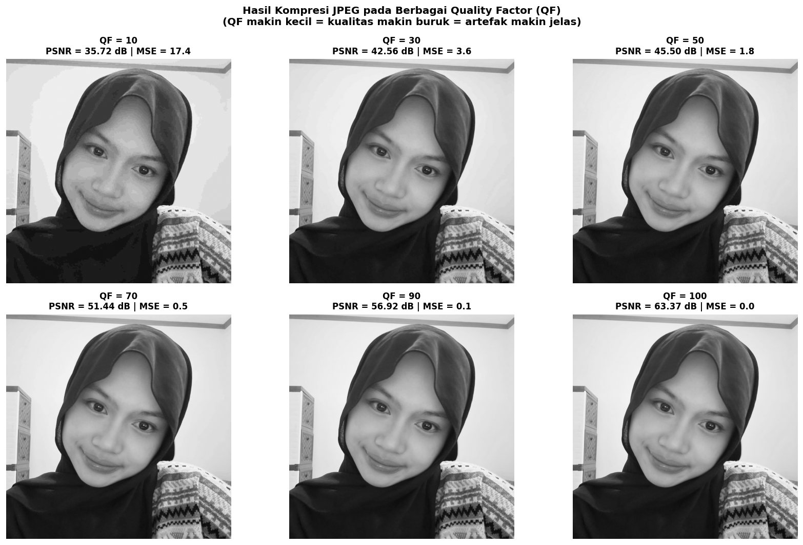

*Artefak "blocking" terlihat jelas pada QF=10, yaitu efek kotak-kotak 8x8 yang muncul akibat kuantisasi agresif. Semakin tinggi QF, semakin halus hasilnya.*

---

## 8. Tahap 5 - Embed Watermark (LSB)

Metode LSB menyisipkan watermark dengan **mengganti bit paling kecil** (bit ke-0) dari setiap nilai piksel dengan satu bit watermark. Karena bit ini hanya mengubah nilai piksel sebesar maksimal 1, perubahannya tidak terlihat oleh mata manusia.

```
Piksel asli   : 10110101  (= 181)
Watermark bit :        1
Piksel baru   : 10110101  (bit LSB sudah 1, tidak berubah)

Piksel asli   : 10110100  (= 180)
Watermark bit :        1
Piksel baru   : 10110101  (= 181, berubah +1)
```

**Implementasi:**
```python
def embed_watermark(image_array, wm):
    img_uint8   = image_array.astype(np.uint8)
    # & 0xFE  -> set bit LSB ke 0  (11111110)
    # | wm    -> set bit LSB sesuai watermark
    watermarked = (img_uint8 & 0xFE) | wm
    return watermarked
```

Watermark yang dipakai adalah **pola kotak-kotak biner** berukuran tile 32x32 piksel, mirip papan catur. Pola ini dipilih karena mudah dibuat, mudah dievaluasi secara visual setelah diekstrak, dan distribusi bit 0 dan 1-nya seimbang (50:50).

```python
for i in range(0, H, 32):
    for j in range(0, W, 32):
        if (i//32 + j//32) % 2 == 0:
            watermark[i:i+32, j:j+32] = 1
```

**Spesifikasi watermark:**

| Parameter | Nilai |
|---|---|
| Ukuran tile | 32 x 32 piksel |
| Total bit watermark | 2.560.000 bit |
| Bit bernilai '1' | 1.280.000 (50%) |
| Bit bernilai '0' | 1.280.000 (50%) |
| MSE (asli vs watermarked) | 0.5006 |
| PSNR (asli vs watermarked) | **51.14 dB** |

> PSNR 51.14 dB membuktikan bahwa perubahan akibat watermark **tidak terlihat secara visual**. Nilai di atas 40 dB umumnya dianggap tidak bisa dibedakan oleh mata manusia.

**Output:**

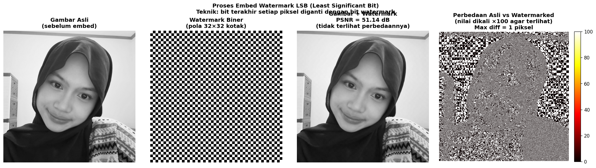

*Dari kiri ke kanan: gambar asli, watermark biner pola kotak-kotak, gambar ter-watermark yang secara visual identik dengan aslinya, dan peta perbedaan yang dikali x100 supaya terlihat. Perubahan maksimalnya hanya 1 nilai piksel.*


---

## 9. Tahap 6 - Ekstraksi & Evaluasi per QF

Setelah gambar ter-watermark dikompres dengan JPEG pada berbagai QF, watermark diekstrak kembali dengan cara mengambil bit LSB setiap piksel:

```python
def extract_watermark(image_array):
    return image_array.astype(np.uint8) & 1   # ambil bit LSB
```

**Metrik evaluasi:**

**1. BER (Bit Error Rate)**
Mengukur berapa banyak bit watermark yang salah setelah ekstraksi. BER = 0.0 berarti watermark sempurna terekstrak, BER = 0.5 berarti watermark sudah hancur total. Threshold yang dipakai: **BER ≤ 0.1**.

**2. NC (Normalized Correlation)**
Mengukur kemiripan antara watermark asli dan watermark hasil ekstraksi. NC = 1.0 berarti identik, NC = 0.0 berarti tidak ada kemiripan sama sekali. Threshold yang dipakai: **NC ≥ 0.9**.

**3. PSNR (Peak Signal-to-Noise Ratio)**
Mengukur kualitas gambar terkompresi dibanding gambar asli. Satuannya dB, semakin tinggi semakin baik.

**Output - Watermark terekstrak untuk semua QF:**

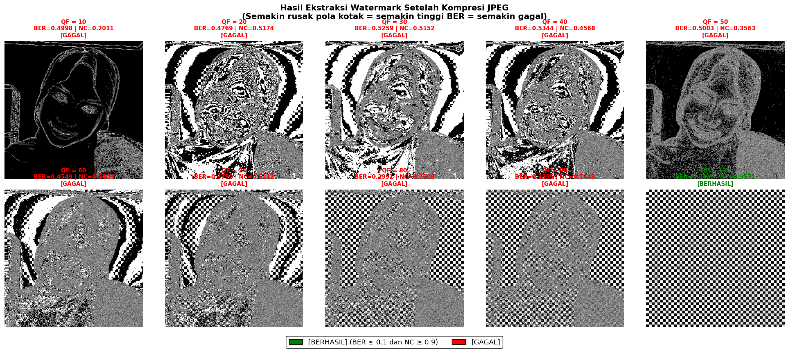

*Bingkai **merah** berarti watermark gagal diekstrak (BER > 0.1 atau NC < 0.9), bingkai **hijau** berarti berhasil. Pada QF 10-90 pola kotak-kotak watermark rusak parah sampai jadi noise acak. Hanya pada QF 100 polanya masih terbaca dengan jelas.*

**Output - Gambar terkompresi untuk semua QF:**

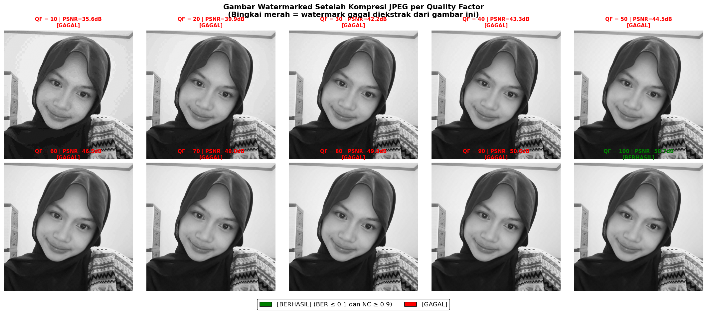

*Perlu diperhatikan bahwa gambar terkompresi QF 50 ke atas secara visual sudah terlihat bagus, tapi watermark di dalamnya sudah hancur karena LSB-nya telah diubah oleh kuantisasi JPEG.*

---

## 10. Tahap 7 - Grafik Evaluasi Metrik

### Grafik BER vs Quality Factor

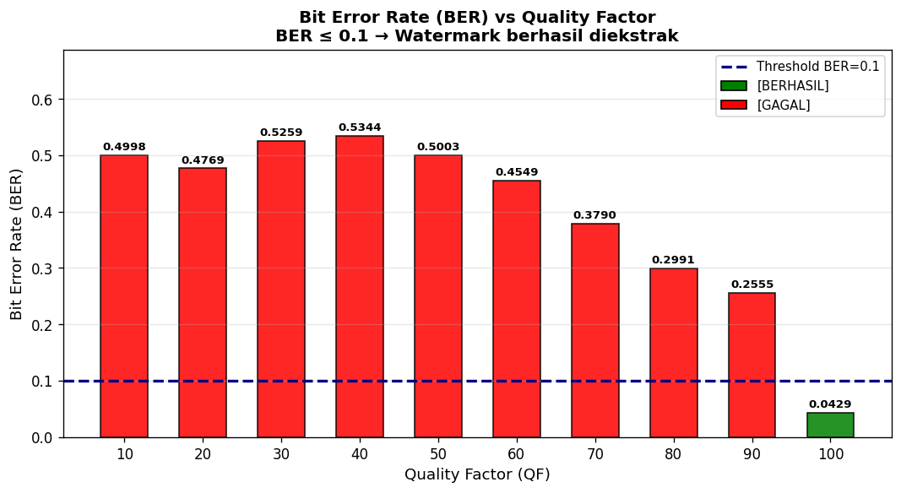

*Batang **merah** berarti gagal (BER > 0.1), batang **hijau** berarti berhasil (BER ≤ 0.1). Pada QF 10-90 nilai BER berkisar antara 0.24-0.53, jauh di atas threshold. Hanya QF 100 (BER = 0.04) yang berhasil.*

### Grafik NC vs Quality Factor

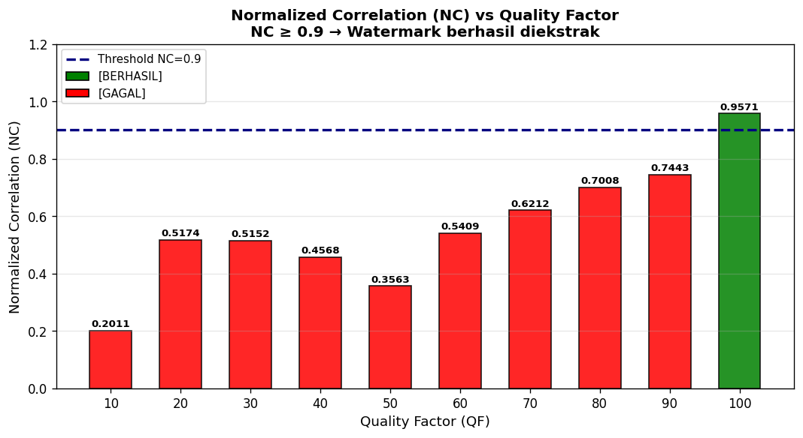

*NC yang rendah (0.20-0.76) pada QF 10-90 menunjukkan bahwa kemiripan antara watermark asli dan watermark terekstrak memang sangat rendah. QF 100 menghasilkan NC = 0.96, sudah di atas threshold 0.9.*

### Grafik PSNR vs Quality Factor

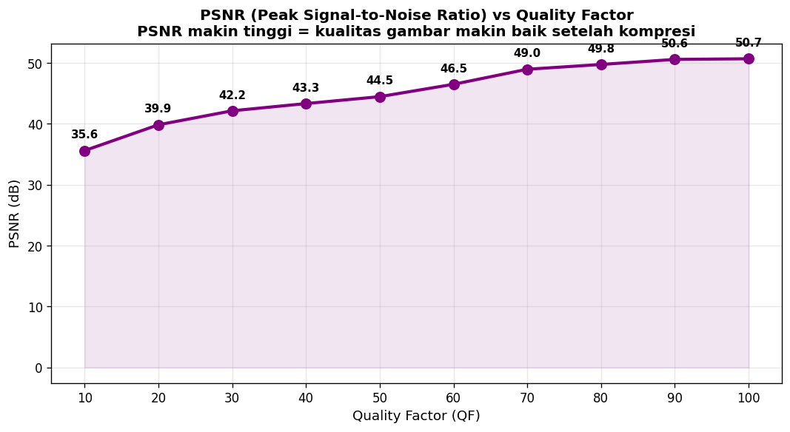

*PSNR naik seiring QF yang lebih tinggi karena kuantisasi yang lebih ringan menghasilkan gambar yang lebih mendekati asli. Tapi PSNR tinggi tidak menjamin watermark berhasil diekstrak, karena PSNR mengukur kualitas gambar secara keseluruhan, bukan integritas bit LSB-nya.*

### Ringkasan Semua Metrik

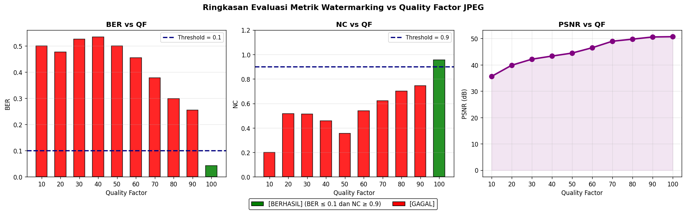

---

## 11. Tabel Hasil Lengkap

| QF | BER | NC | PSNR (dB) | Status |
|:---:|:---:|:---:|:---:|:---:|
| 10 | 0.4998 | 0.2009 | 35.62 | GAGAL |
| 20 | 0.4751 | 0.5195 | 39.89 | GAGAL |
| 30 | 0.5267 | 0.5152 | 42.12 | GAGAL |
| 40 | 0.5308 | 0.4620 | 43.40 | GAGAL |
| 50 | 0.5007 | 0.3598 | 45.01 | GAGAL |
| 60 | 0.4544 | 0.5405 | 47.04 | GAGAL |
| 70 | 0.3702 | 0.6294 | 49.04 | GAGAL |
| 80 | 0.2893 | 0.7108 | 49.73 | GAGAL |
| 90 | 0.2446 | 0.7553 | 50.73 | GAGAL |
| **100** | **0.0400** | **0.9600** | **50.71** | **BERHASIL** |

**Threshold:** BER ≤ 0.1 **DAN** NC ≥ 0.9

---

## 12. Analisis

Kompresi JPEG bekerja begini: gambar dibagi blok 8x8, lalu DCT dilakukan per blok, koefisien DCT dibagi tabel kuantisasi dan dibulatkan ke bilangan bulat, kemudian invers DCT menghasilkan nilai piksel yang **sedikit berbeda** dari aslinya.

Perubahan kecil ini, bahkan hanya ±1 atau ±2 pada nilai piksel, sudah cukup untuk **membalik bit LSB** secara acak. Karena seluruh watermark disimpan di bit LSB, satu kali kompresi JPEG sudah bisa menghancurkan watermark hampir sepenuhnya.

QF 100 berhasil karena tabel kuantisasinya pakai nilai pembagi yang sangat kecil, jadi hampir tidak ada pembulatan yang terjadi dan nilai piksel hasil dekompresi sangat dekat dengan aslinya. Walaupun begitu, BER masih 0.04 (4%) karena QF 100 bukan berarti lossless sepenuhnya.

---

## 13. Cara Menjalankan

### Prasyarat

```bash
pip install numpy pillow matplotlib scipy
```

### Menjalankan

```bash
# Pastikan foto_kakey.png ada di folder watermarking/ yang sama dengan watermarking.py
python watermarking/watermarking.py
```

### Konfigurasi (opsional)

Bisa diubah di bagian `KONFIGURASI` di awal `watermarking.py`:

```python
NAMA_FOTO       = "foto_kakey.png"   # ganti dengan nama foto yang dipakai
BLOCK_SIZE      = 8                   # ukuran blok DCT (standar JPEG = 8)
WATERMARK_TILE  = 32                  # ukuran kotak pola watermark
QUALITY_FACTORS = [10, 20, ..., 100]  # daftar QF yang diuji
THRESHOLD_BER   = 0.1                 # batas BER untuk dinyatakan berhasil
THRESHOLD_NC    = 0.9                 # batas NC untuk dinyatakan berhasil
```

Setelah dijalankan, 13 file gambar dan 1 file `watermarked_original.png` akan tersimpan di folder `output/`.

---

*Python 3 - NumPy - Pillow - Matplotlib - SciPy*
